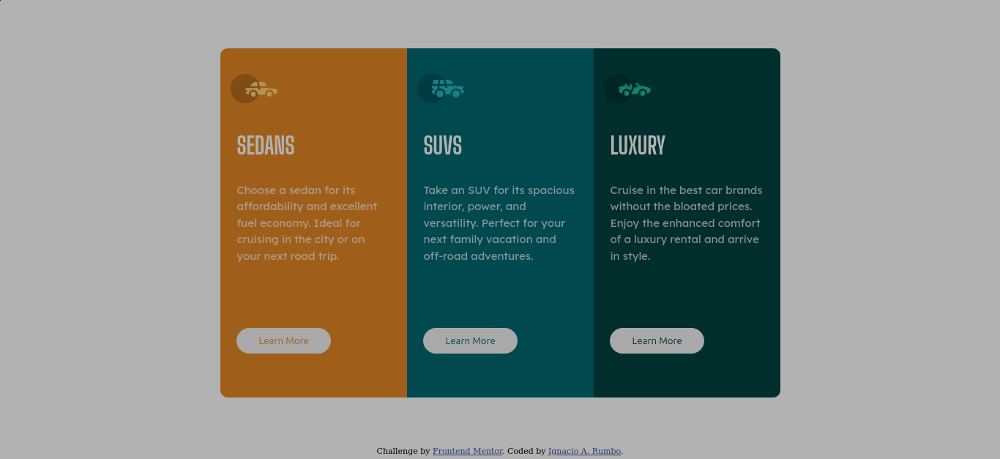

# Frontend Mentor - 3-column preview card component solution

This is a solution to the [3-column preview card component challenge on Frontend Mentor](https://www.frontendmentor.io/challenges/3column-preview-card-component-pH92eAR2-). Frontend Mentor challenges help you improve your coding skills by building realistic projects. 

## Table of contents

- [Overview](#overview)
  - [The challenge](#the-challenge)
  - [Screenshot](#screenshot)
  - [Links](#links)
- [My process](#my-process)
  - [Built with](#built-with)
  - [What I learned](#what-i-learned)
  - [Continued development](#continued-development)
  - [Useful resources](#useful-resources)
- [Author](#author)
- [Acknowledgments](#acknowledgments)

**Note: Delete this note and update the table of contents based on what sections you keep.**

## Overview

### The challenge

Users should be able to:

- View the optimal layout depending on their device's screen size
- See hover states for interactive elements

### Screenshot

### Links

- Solution URL: [Git hub repo](https://github.com/ignaciorumbodesk/3-column-preview-card-component-main)
- Live Site URL: [Git Pages 3 columns component](https://ignaciorumbodesk.github.io/3-column-preview-card-component-main/)

## My process
My coding process start with the analysis of the design. In the next step. I translate the design into the DOM model.
### Built with
- Semantic HTML5 markup
- CSS custom properties
- Flexbox

### Continued development

I'm focusing on improve CSS skills adding some Js concepts

### Useful resources

- [W3 School](https://www.w3school.com) - HTML and CSS Concepts, definitions, explanations, examples.
- [Css-tricks](https://www.css-tricks.com/.com) - Flexbox concepts. 

## Author

- Frontend Mentor - [@ignaciorumbodesk](https://www.frontendmentor.io/profile/ignaciorumbodesk)
- Twitter - [@ignacio_85r](https://www.twitter.com/ignacio_85r)
